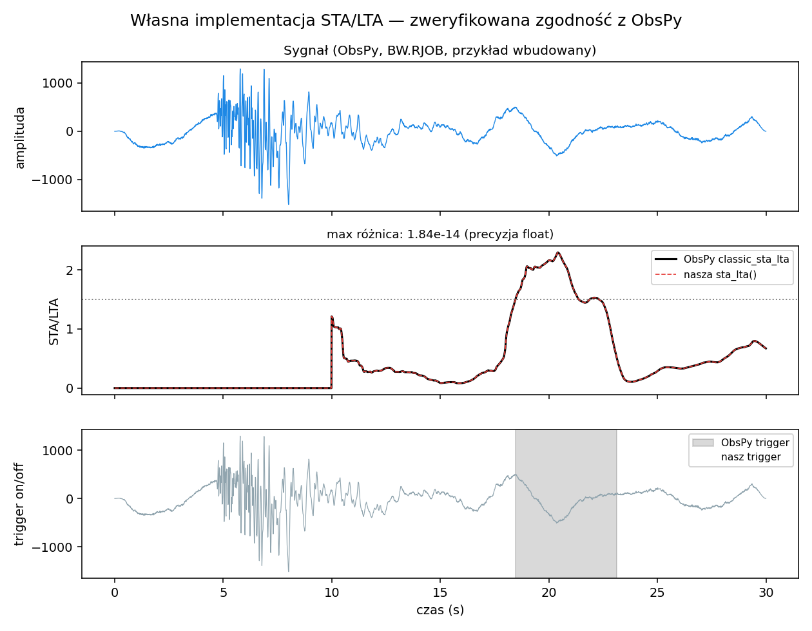
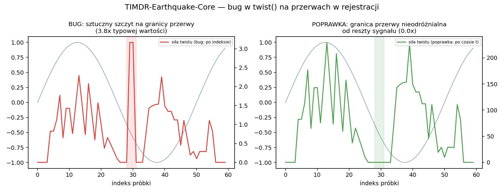
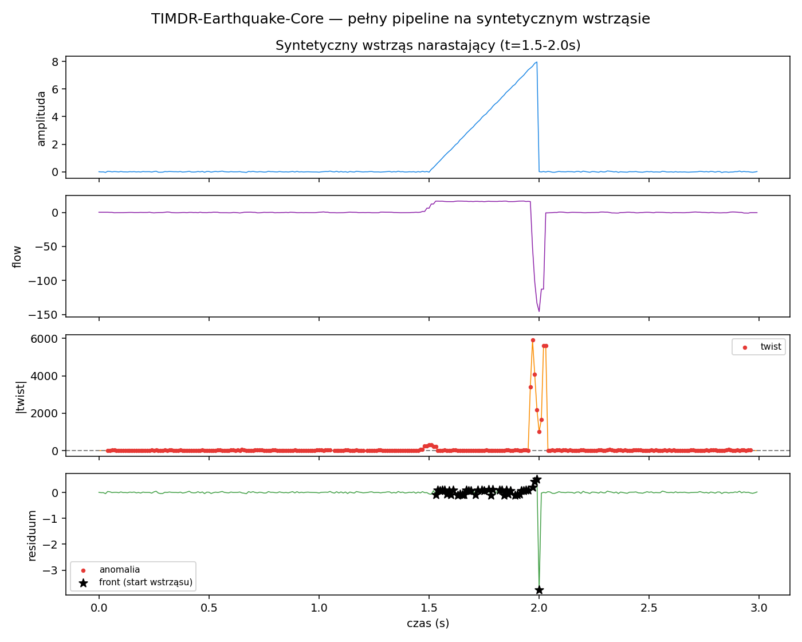

# TIMDR-Earthquake-Core

Rdzeń analizy sejsmicznej (`timdr_core_earthquake.py`): lokalny gradient
amplitudy (flow), nagłe zmiany kierunku / początek wstrząsu (twist),
wygładzenie szumu (TRM), mikro-wstrząsy (anomalies), punkty rozpoczęcia
wstrząsu (fronts) i klasyczny picker STA/LTA (`sta_lta` /
`trigger_onset`).

## Status

Kod ze zgłoszenia uruchomiony i przetestowany (41/41 testów łącznie:
`test_timdr_core_earthquake.py` + `test_catalog_core.py`). Potwierdzone:
nie crashuje na n=0/1/2 (zgodnie z opisem zgłoszenia). Znalezione i
naprawione łącznie 3 błędy (2 w rdzeniu waveform, 1 w nowym trybie
katalogowym), wszystkie realnie wpływające na dokładność detekcji na
prawdziwych danych sejsmicznych.

## 🆕 STA/LTA — klasyczny picker, zweryfikowany zgodnie z ObsPy



Na pytanie "czy da się zaimplementować u nas to, co ma ObsPy" —
odpowiedź: tak, i to bez dokładania ObsPy jako zależności. `sta_lta()`
i `trigger_onset()` to własna implementacja klasycznego algorytmu
STA/LTA napisana od podstaw wg powszechnie znanego wzoru (stosunek
krótko- do długoterminowej średniej energii sygnału), **nie** skopiowana
z kodu ObsPy.

Zweryfikowano najsurowszym możliwym testem: bezpośrednie porównanie
liczba-po-liczbie z `obspy.signal.trigger.classic_sta_lta` i
`trigger_onset` na prawdziwych danych sejsmicznych (przykładowy strumień
dołączony do samego ObsPy, stacja BW.RJOB) — wynik identyczny do ~1e-14
(precyzja zmiennoprzecinkowa) na całej długości sygnału, dla kilku
różnych kombinacji okien i progów, włącznie z przypadkiem dwóch
osobnych zdarzeń. Test `test_sta_lta_i_trigger_onset_zgodne_z_obspy`
pomija się automatycznie, jeśli ObsPy nie jest zainstalowane — to
opcjonalna weryfikacja, nie twarda zależność repo (do samego
`sta_lta()`/`trigger_onset()` potrzeba tylko numpy).

Po drodze złapałem i poprawiłem dwa subtelne błędy off-by-one względem
naiwnej pierwszej wersji: (1) pierwsze `nlta-1` próbek (niepełne okno
LTA) muszą zwracać 0, nie stosunek z okna "rozpędzającego się" — dla
pierwszej próbki taki stosunek zawsze wychodzi dokładnie 1.0, bez
sensu fizycznego; (2) `trigger_onset` musi zapisywać jako koniec
zdarzenia OSTATNI indeks jeszcze powyżej progu wyłączenia, nie pierwszy
indeks poniżej niego.

## 🐛 Błąd 1: `twist()` liczył gradient po indeksie próbki, nie po czasie



```python
dg = np.gradient(flow_grad)  # bez t
```

`flow()` poprawnie liczy lokalny gradient względem **rzeczywistego
czasu** (LSQ na `t`), ale `twist()` różniczkował wynik `flow()` względem
**indeksu próbki**, tracąc tę informację. Dla ciągłego, równomiernie
próbkowanego sygnału to nie robi różnicy (stały mnożnik). Ale realne
dane sejsmiczne rzadko są tak czyste — **przerwy w rejestracji**
(dropout telemetrii, scalanie segmentów z różnych stacji, luki po
restarcie sprzętu) są normą, nie wyjątkiem.

Zweryfikowano na czystej fali sinusoidalnej z 3-sekundową przerwą
pośrodku (fizycznie: to samo gładkie zjawisko, tylko nie zarejestrowane
przez chwilę): oryginalny kod dawał na granicy przerwy szczyt "siły
twistu" **3.8× większy** niż typowa wartość w reszcie sygnału — fałszywy
alarm wywołany wyłącznie strukturą przerwy w danych, nie żadną
prawdziwą zmianą fizyczną. Po poprawce (`np.gradient(flow_grad, t)`)
granica przerwy wypada **0.0×** typowej wartości — poprawnie rozpoznana
jako nic nadzwyczajnego.

**Zmiana API:** `twist()` teraz przyjmuje `t` jako argument
(`twist(flow_grad, t, threshold=0.4)`) — bez tego nie da się poprawnie
liczyć gradientu względem czasu. `fronts()` już to uwzględnia.

## 🐛 Błąd 2: `anomalies()` — próg zerowy na skwantowanym sygnale

Gdy sygnał jest silnie skwantowany / ma dużo powtórzonych wartości
(typowe dla przetworników o ograniczonej rozdzielczości albo
skompresowanych formatów danych sejsmicznych), mediana bezwzględnych
reszt (MAD) może wyjść dokładnie **0**. Próg detekcji (`factor * mad`)
wychodzi wtedy też 0, i **każda niezerowa reszta** — łącznie z czystym
szumem numerycznym — zostaje sklasyfikowana jako "anomalia".

Zweryfikowano: na gładkim, tylko-zaokrąglonym sygnale sinusoidalnym (bez
żadnej realnej anomalii) dawało to **7 z 30 punktów (23%)** fałszywie
sklasyfikowanych jako mikro-wstrząsy. Naprawiono: gdy MAD wychodzi ~0,
próg spada na odchylenie standardowe reszt (a jeśli i to jest ~0 —
sygnał faktycznie stały — używana jest mała stała zamiast dosłownego
zera).

## ✅ Co faktycznie działa dobrze (potwierdzone testami)

- `flow()` poprawnie liczy lokalny gradient względem rzeczywistego
  czasu metodą regresji LSQ — dobry wybór, w przeciwieństwie do
  wcześniejszych modułów w tej serii (Radar-TIMDR, Echosonda-3D), gdzie
  to właśnie brakowało.
- Odporność na krótkie sygnały (n=0,1,2) — potwierdzona testem, zgodnie
  z zapowiedzią w opisie zgłoszenia.
- `trm()` (mediana k-NN w czasie) poprawnie wygładza szum.
- Pełny pipeline `fronts()` poprawnie wykrywa początek syntetycznego,
  narastającego wstrząsu i **nie generuje fałszywego frontu** na gładkiej
  fali z przerwą w rejestracji (patrz test
  `test_fronts_brak_falszywego_frontu_na_gladkiej_fali_z_przerwa`).



## 🎯 Zastosowania i warunki

- **Monitoring ciągły z realną telemetrią**: błąd 1 był tu szczególnie
  ważny — bez poprawki każda przerwa w danych ryzykowała fałszywy alarm
  detekcji.
- **Krótkie, wyzwalane nagrania** (triggered recording, cała próbka to
  głównie wstrząs): błąd 2 (MAD=0) jest tu bardziej prawdopodobny przy
  danych o niskiej rozdzielczości - warto sprawdzić próg `th` zwracany
  przez `anomalies()` i upewnić się, że nie jest podejrzanie mały.
- **`threshold` w `twist()` i `factor` w `anomalies()`** to punkty
  startowe (odpowiednio 0.4 i 3.0), nie zwalidowane normy — zależą od
  czułości sensora, poziomu szumu tła i tego, co uznajesz za "istotną"
  zmianę. Wymagają kalibracji na Twoich danych.
- Metoda nie jest przyczynowa w pełnym sensie (k-NN w czasie może
  sięgać w przyszłość względem próbki), więc do detekcji w czasie
  rzeczywistym nadaje się z niewielkim opóźnieniem, nie "na bieżąco" bez
  żadnego lagu.

## 🆕 Tryb katalogowy — `catalog_core.py`, zweryfikowany na żywych danych USGS

Powyższy `timdr_core_earthquake.py` jest zbudowany pod **falę** (ciągła
amplituda z sejsmometru). Katalog zdarzeń (lista trzęsień: czas +
magnitude, jak z `earthquake.usgs.gov/fdsnws/event`) to inny typ danych
— rzadki, nieregularny proces punktowy. `catalog_core.py` to osobna,
mała implementacja tej samej rodziny detektorów (anomaly / trend /
rhythm) przystosowana do listy zdarzeń, tego samego typu co
`TIMDRIndustrialFusion` z TIMDR-Industrial-Predict (kod zduplikowany
celowo — dwa niezależne repo, bez wzajemnych importów).

Zweryfikowano na **żywych danych USGS**, pobranych 2026-08-14 (M5.0+,
2026-08-01 do 2026-08-14, 64 zdarzenia, w tym mainshock M7.4 w
Kolumbii) — patrz `demo_usgs_catalog.py`:

- **Anomalie**: poprawnie wskazuje 5 największych zdarzeń (M5.7, dwa
  M6.3, M6.0, M7.4) jako anomalie, z mainshockiem na szczycie
  (z=14.84).
- **Aftershock**: pierwsze zdarzenie po mainshocku M7.4 to M5.0, 43.7
  minuty później — niezależnie od TIMDR, to zgodny z realną
  sejsmologią wzorzec główny wstrząs → aftershock, znaleziony wprost w
  danych.
- **Rytm — błąd znaleziony i naprawiony po drodze**: pierwsza wersja
  tego demo liczyła `rhythm()` na `E=|MAD-z(magnitude)|`, kopiując 1:1
  wzorzec z wielocechowego `fuse()` z TIMDR-Industrial-Predict. Dla
  **pojedynczej** cechy branie wartości bezwzględnej z MAD-z tworzy
  sztuczną okresowość z rektyfikacji (ten sam mechanizm co
  udokumentowany błąd L2-norm w TIMDR-Industrial-Fusion) — dawało to
  graniczny fałszywy alarm: `score=0.434`, tuż nad progiem 0.4, na
  danych, które nie mają żadnej prawdziwej okresowości (globalna
  sejsmiczność M5+ jest w przybliżeniu procesem Poissona). Naprawiono:
  `rhythm()` w `catalog_core.py` liczy autokorelację bezpośrednio na
  wartości ze znakiem, nie na rektyfikowanej. Po poprawce ten sam
  katalog poprawnie daje `[]`, `0.0` — brak wykrytej okresowości.

**Nadal aktualne ograniczenie** (udokumentowane w docstringu, nie
błąd): lag w `rhythm()` liczony jest po indeksie zdarzenia w katalogu,
nie po realnym czasie — "okres=N" znaczy "co N zdarzeń", nie "co N
godzin". Dla katalogu o bardzo nierównomiernych odstępach to może dać
matematycznie poprawny, ale mylnie nazwany wynik. Do prawdziwej
periodyczności względem czasu (cykle pływowe, sezonowe wyzwalanie)
lepszy byłby Lomb-Scargle.

```python
from catalog_core import TIMDRCatalogFusion

cat = TIMDRCatalogFusion()
idx, z = cat.anomalies(magnitude)                 # najwieksze/najmniejsze zdarzenia
slopes, tz = cat.trend(t, magnitude, window=15)    # narastajaca/malejaca aktywnosc
periods, score = cat.rhythm(magnitude)             # UWAGA: lag w zdarzeniach, nie w czasie
next_idx, dt = cat.nearest_aftershock(t, magnitude)
```

Uruchomienie: `python demo_usgs_catalog.py` (instrukcja odświeżenia
danych live na aktualny katalog USGS w nagłówku pliku).

## Przykład użycia

```python
from timdr_core_earthquake import TIMDR_EarthquakeCore

core = TIMDR_EarthquakeCore()
flow_grad = core.flow(t, s)
twist_pts, twist_strength = core.twist(flow_grad, t)   # teraz wymaga t
smooth = core.trm(t, s)
anomaly_pts, residuals, th = core.anomalies(t, s)
fronts, _, _ = core.fronts(t, s)
```

Uruchomienie: `python demo.py` / testy: `pytest -q`.

## Cztery dodatki (bez zmiany domyślnego zachowania istniejących metod)

Po przeglądzie kodu padła propozycja siedmiu usprawnień, w tym modułu
"interpretacji fizycznej" mapującego flow/twist/rhythm na
EARTHQUAKE/BLAST/NOISE/MINING/TECTONIC. Ten moduł **celowo nie
powstał** — pojedynczy kanał amplitudy `s(t)` nie niesie informacji
potrzebnej do takiego rozróżnienia (P vs S wymaga polaryzacji/3
składowych, trzęsienie vs wybuch klasycznie rozróżnia się widmowo,
np. Pn/Lg, plus głębokość/czas trwania) — nazwanie kategorii
prawdziwymi terminami sejsmologicznymi nie tworzy między nimi mostu
fizycznego. Zaimplementowane zostały cztery pozostałe, które da się
uczciwie policzyć z samego `s(t)`:

- **Szybszy `flow()`/`trm()`** — KDTree per-punkt zastąpiony helperem
  `_nearest_k_bounds()`: skoro `t` jest ściśle rosnące, k najbliższych
  sąsiadów po czasie zawsze tworzy ciągły przedział indeksów wokół `i`,
  więc wystarczy dwuwskaźnikowe rozszerzanie okna zamiast budowy
  drzewa. Zweryfikowano identyczność z KDTree (0 rozbieżności na 80
  próbkach z przerwą w rejestracji) i przyspieszenie ~2.5x na n=20000.
  Uwaga: to NIE jest sztywne okno po indeksie `[i-k:i+k]` (taka wersja
  zepsułaby się dokładnie tam, gdzie `twist()` już raz naprawił błąd z
  przerwą w telemetrii) — sąsiedztwo liczone jest po realnej
  odległości w `t`.
- **`trm(..., method="adaptive"/"savgol")`** — obok domyślnej mediany
  k-NN: `"adaptive"` skaluje rozmiar okna odwrotnie do lokalnej
  zmienności (mniejsze okno tam, gdzie dzieje się coś realnego, żeby
  mediana nie "usztywniała" skoku; większe w spokojnym tle, dla
  mocniejszego wygładzenia szumu); `"savgol"` to filtr
  Savitzky-Golay jako alternatywa lepiej zachowująca kształt zbocza
  (zakłada w przybliżeniu równomierne próbkowanie — nie używać przy
  danych z lukami czasowymi).
- **`classify_anomalies(t, s)`** — grupuje sąsiednie punkty z
  `anomalies()` w zdarzenia i opisuje ich KSZTAŁT (nie typ fizyczny):
  `impuls` (pojedyncza próbka, wraca), `spike` (krótki wybuch, wraca),
  `step` (trwały skok poziomu), `drift` (poziom narasta stopniowo, nie
  skokiem), `dropout` (długi bieg praktycznie identycznych wartości —
  typowe dla utkniętego czujnika, wykrywane niezależnie od progu MAD,
  bo środek długiego płaskiego biegu ma lokalną medianę równą sobie
  samemu i `anomalies()` go nie łapie).
- **`hybrid_trigger(t, s, nsta, nlta)`** — zdarzenie z
  `trigger_onset(sta_lta(...))` jest potwierdzone tylko, gdy w jego
  sąsiedztwie występuje też silny `twist` ORAZ punkt z `anomalies()`;
  bez tego trafia do listy `rejected` z podanym powodem
  (`missing_twist`/`missing_anomaly`). To ogranicza false positives
  samego STA/LTA (reaguje na każdy wzrost energii), ale **nie jest to
  zwalidowane względem katalogu prawdziwych zdarzeń** — czy to
  faktycznie poprawia precision/recall, a nie tylko obcina też
  prawdziwe wykrycia, wymaga testu na danych z etykietami, tak jak
  każdy inny próg w tym projekcie.

```python
smooth_adapt = core.trm(t, s, method="adaptive")
smooth_sg = core.trm(t, s, method="savgol", window_length=11, polyorder=3)
events = core.classify_anomalies(t, s)          # [{'start','end','duration','type','level_shift'}, ...]
confirmed, rejected = core.hybrid_trigger(t, s, nsta=50, nlta=500)
```

33 nowe/zaktualizowane testy w `test_timdr_core_earthquake.py` (razem
34, 1 pomijany bez ObsPy) — `pytest -q`.
