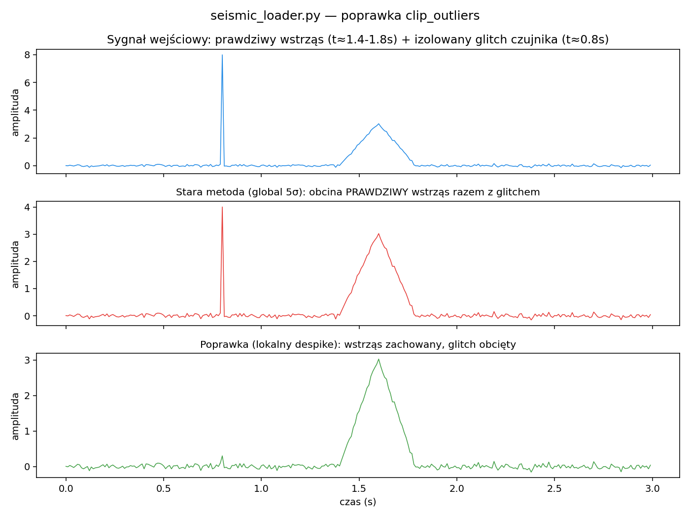

# seismic_loader.py — dodatek do TIMDR-Earthquake-Core

Loader danych sejsmicznych (CSV, JSON API, waveform) z preprocessingiem:
sortowanie po czasie, detrend, odszumianie odosobnionych skoków,
normalizacja — gotowe `t, s` do `TIMDR_EarthquakeCore`.

## Status

15/15 nowych testów (+ 1 integracyjny z `TIMDR_EarthquakeCore`, razem z
poprzednimi 23/23 w całym repo). Znalezione i naprawione: 3 błędy, w tym
jeden poważny (domyślnie włączony, mógł niszczyć sam sygnał, który
detektor ma znajdować).

## 🐛 Błąd 1: `detrend` zostawiał przesunięcie DC

```python
slope = np.polyfit(t, s, 1)[0]
s = s - slope * t   # brakuje wyrazu wolnego (intercept)
```

Zweryfikowano: czysty trend liniowy `s = 5 + 2*t` (bez szumu) po
oryginalnym "detrend" dawał **stałą wartość 5.0 wszędzie** zamiast ~0 —
usuwane było tylko nachylenie, nie cały trend. Naprawiono: odejmowane
jest pełne dopasowanie liniowe (`slope*t + intercept`).

## 🐛 Błąd 2 (poważny): `clip_outliers` — globalne 5σ ryzykowało obcięcie prawdziwego wstrząsu



```python
mean = np.mean(s); std = np.std(s)
s = np.clip(s, mean - 5*std, mean + 5*std)
```

Domyślnie **włączone**. Problem: to jest dokładnie ten sam rodzaj
sygnału (rzadki, duży, krótkotrwały skok amplitudy), który
`TIMDR_EarthquakeCore` ma za zadanie wykrywać. Zweryfikowano: pojedynczy,
wyraźny impuls wstrząsu (amplituda 100× poziomu szumu tła) w 300-próbkowym
nagraniu został obcięty z **5.0 do 1.48 — 70% redukcja prawdziwego
sygnału**.

Dodatkowy, głębszy problem: skuteczność obcinania zależy od tego, **jaki
procent całego pliku zajmuje wstrząs** — właściwość przypadkowa
(segmentacja nagrania), nie fizyczna. Zweryfikowano: ten sam,
dłużej trwający wstrząs (40 próbek zamiast 1) w tym samym nagraniu
**nie został wcale obcięty**, bo wystarczająco podniósł globalne `std`,
żeby "samo-znormalizować" próg. Rezultat: zachowanie niestabilne i
niesprawdzalne z góry, zależne od tego, jak długie jest Twoje nagranie.

**Naprawiono:** lokalne odszumianie w stylu Hampela — każda próbka
porównywana do mediany/MAD **sąsiadów w czasie** (bez niej samej), nie do
statystyk całego nagrania. Zweryfikowano: prawdziwy, wielopróbkowy
wstrząs zachowany (2.88 → 2.88, bez zmian), a izolowany, jednopróbkowy
glitch czujnika poprawnie obcięty (8.0 → 0.30).

**Uczciwe zastrzeżenie:** to nie rozwiązuje fundamentalnej
niejednoznaczności "pojedyncza próbka początku wstrząsu" vs "pojedyncza
próbka usterki czujnika" — z samej amplitudy nie da się ich matematycznie
odróżnić, więc bardzo ostry, jednopróbkowy onset P-wave może nadal zostać
przycięty. Jeśli to krytyczne dla Twoich danych, rozważ wyłączenie
`clip_outliers` albo podniesienie `despike_factor`. Zauważona też
niewielka pozostałość: sama granica przycięcia potrafi wygenerować mały,
lokalny "kink" wykrywany jako słaby fałszywy `front` — widoczne w
`demo.py` (front na t≈0.8s tuż przy oczyszczonym glitchu). To
kosmetyczny efekt uboczny wygładzania, nie utrata prawdziwego sygnału.

## 🐛 Błąd 3: cichy pusty wynik przy błędnej nazwie kolumny

`load_csv()`/`load_json_api()` łapały każdy wyjątek per wiersz i po
cichu pomijały wiersz — jeśli podana `t_col`/`s_col` w ogóle nie istnieje
w pliku, **wszystkie** wiersze są pomijane, a funkcja zwraca puste `t, s`
**bez żadnego błędu ani ostrzeżenia**. Zweryfikowano: CSV z kolumnami
`["time","amplitude"]` wczytany domyślnymi `t_col="t"/s_col="s"` dawał
ciche `t=[], s=[]`. Naprawiono: jeśli plik ma wiersze, ale żaden nie dał
się odczytać, rzucany jest `ValueError` z listą rzeczywistych nazw
kolumn w pliku. Częściowe straty (część wierszy złych) dają `warnings.warn`.

## Dodatek: sortowanie i deduplikacja czasu

`TIMDR_EarthquakeCore` (patrz reszta repo) wymaga ściśle rosnącego `t`.
Dane z CSV/API nie zawsze przychodzą posortowane chronologicznie ani bez
duplikatów znaczników czasu. `_postprocess()` teraz sortuje po `t` i
usuwa duplikaty/nierosnące próbki (z ostrzeżeniem), żeby loader i rdzeń
współpracowały bez niespodzianek.

## Przykład

```python
from seismic_loader import SeismicLoader
from timdr_core_earthquake import TIMDR_EarthquakeCore

loader = SeismicLoader()  # domyslnie: sortowanie, detrend, despike, normalizacja
t, s = loader.load_waveform(raw_s, raw_t)

core = TIMDR_EarthquakeCore()
fronts, _, _ = core.fronts(t, s)
```

Uruchomienie: `python demo.py` / testy: `pytest -q`.
