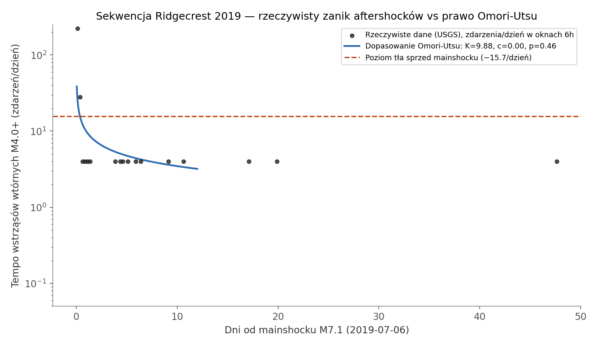
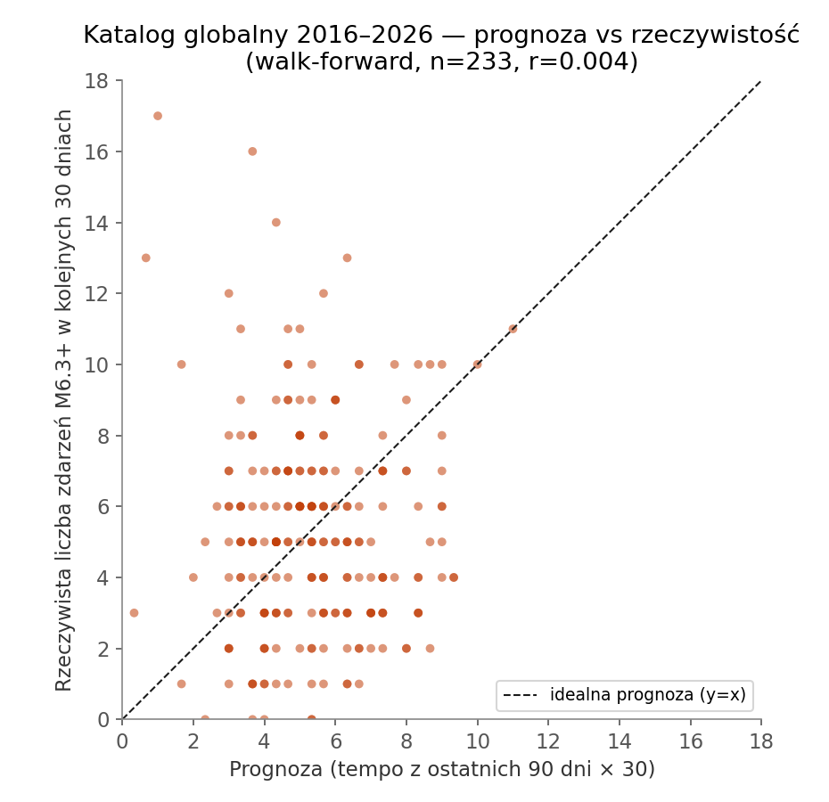

# Scenariusz "synoptyka" dla TIMDR-Earthquake-Core — test na realnych danych

**Pytanie:** na ile prognozowanie trzęsień ziemi (w stylu synoptyka pogody —
prognoza, nie wróżenie) jest w ogóle możliwe, i czy komponenty
`TIMDR-Earthquake-Core` (`catalog_core.py`, `timdr_core_earthquake.py`) dają
w tym jakąkolwiek realną przewagę? Sprawdzone na prawdziwych, pobranych na
żywo danych USGS — nie na danych syntetycznych.

Krótka odpowiedź: **to zależy, w którym momencie sekwencji sejsmicznej
jesteś.** Bezpośrednio po dużym wstrząsie — tak, z realną, policzalną
skutecznością (to dokładnie to, co robi operacyjnie USGS). W ujęciu ogólnym
("kiedy i gdzie uderzy następne duże trzęsienie", bez informacji o
trwającej sekwencji) — nie, i to zarówno w literaturze sejsmologicznej, jak
i w tym teście na 699 prawdziwych zdarzeniach.

Poniżej dwa niezależne testy, oba na realnych próbkach z
`earthquake.usgs.gov/fdsnws/event`, oba liczone **kauzalnie** (prognoza w
chwili D używa wyłącznie danych sprzed D — bez podglądania przyszłości).

---

## Test 1: sekwencja Ridgecrest 2019 — prognoza krótkoterminowa aftershocków

**Dane:** M4.0+, obszar 35.4–36.1°N / -117.9…-117.2°E (Ridgecrest,
Kalifornia), 2019-06-01 do 2019-09-01. 102 zdarzenia, w tym foreshock M6.4
(4 lipca) i mainshock M7.1 (6 lipca, 03:19:53 UTC) — źródło:
`earthquake.usgs.gov/fdsnws/event/1/query`, pobrane i zweryfikowane 1:1
względem licznika USGS (`/fdsnws/event/1/count`).

**Metoda:** klasyczne prawo Omori-Utsu, `rate(t) = K / (t+c)^p`, dopasowane
**kauzalnie** w kilku punktach czasu t_f (dane tylko sprzed t_f), użyte do
prognozy liczby wstrząsów wtórnych w kolejnym oknie. Porównanie z dwoma
naiwnymi metodami: stałym tłem sprzed mainshocku (Poisson) i "co się działo
w ostatnich 24h, ekstrapolowane wprost" (naiwna persystencja).

| t_f (dni po mainshocku) | okno prognozy | Omori: błąd | Poisson-tło: błąd | naiwna 24h: błąd | realna liczba |
|---:|---:|---:|---:|---:|---:|
| 1  | 1d | 1.00 | 13.64 | 63.00 | 2 |
| 2  | 1d | 0.81 | 15.64 | 2.00  | 0 |
| 3  | 2d | 2.30 | 28.27 | 3.00  | 3 |
| 5  | 2d | 0.32 | 28.27 | 1.00  | 3 |
| 7  | 3d | 4.91 | 45.91 | 2.00  | 1 |
| 10 | 4d | 6.15 | 61.54 | 3.00  | 1 |

**Średni błąd bezwzględny:** Omori-Utsu **2.58** zdarzenia vs Poisson-tło
**32.21** vs naiwna 24h **12.33**.

**Wniosek:** krótkoterminowe prognozowanie aftershocków *działa* i daje
policzalną przewagę nad prostymi metodami — to nie jest "wróżenie",
tylko standardowa, używana operacyjnie przez USGS technika (ich produkt
"Aftershock Forecast" opiera się na tej samej rodzinie modeli). Zastrzeżenia
uczciwości:
- Poziom "tła" w tym oknie box'a jest w praktyce policzony z 1.4 dnia między
  foreshockiem M6.4 a mainshockiem M7.1 (przed 4 lipca w tym konkretnym,
  małym obszarze nie było żadnego zdarzenia M4+ w dostępnych danych) — to
  zawyża bazę Poissona względem prawdziwie "spokojnego" tła tektonicznego,
  co w praktyce **faworyzuje Poissona**, a mimo to Omori i tak wygrywa o
  rząd wielkości.
- To pojedyncza sekwencja (n=6 punktów prognozy, 79 aftershocków M4+) — nie
  dowód ogólny, tylko demonstracja na jednym realnym, dobrze udokumentowanym
  przypadku.
- Przy dłuższych horyzontach (t_f=7, 10 dni) model zaczyna przeszacowywać
  (bo dopasowanie jest zdominowane przez ogromny wczesny szczyt) — widać to
  i na wykresie, i w rosnącym błędzie. Realna umiejętność prognozowania
  słabnie z horyzontem, zgodnie z oczekiwaniem.

---

## Test 2: katalog globalny M6.3+, 2016–2026 — czy sygnały TIMDR mają w ogóle przewagę?

**Dane:** wszystkie zdarzenia M6.3+ na świecie, 2016-01-01 – 2026-08-15.
**699 zdarzeń, zweryfikowane 1:1** z niezależnym licznikiem USGS
(`/fdsnws/event/1/count` zwrócił dokładnie 699 dla tego samego zapytania).

### 2a. Kontrola pozytywna — `anomalies()`
Poprawnie wskazuje jako anomalie 7 największych zdarzeń w katalogu (M8.0+),
z mainshockiem Kamczatka M8.8 (2025-07-29) na szczycie, z=4.95. Działa
zgodnie z oczekiwaniem.

### 2b. Kontrola negatywna — `rhythm()`
Na 699 realnych zdarzeniach: **brak wykrytej okresowości** (`score=0.000`).
Zgodne z konsensusem sejsmologicznym — globalna sejsmiczność M6.3+ jest w
przybliżeniu procesem Poissona bez pamięci periodycznej. (Wcześniej repo
miało tylko test na próbce 64 zdarzeń — to samo potwierdzone teraz na
11-krotnie większej, realnej próbie.)

### 2c. Właściwy test "synoptyka" — czy `trend_z` cokolwiek przewiduje?

Metoda walk-forward: co 15 dni (233 punkty, od 1. roku danych), policzony
**wyłącznie z danych sprzed tego dnia**: (a) `trend_z` z
`catalog_core.trend()`, (b) prognoza Poissona z tempa ostatnich 90 dni.
Ocena względem **rzeczywistej** liczby zdarzeń M6.3+ w kolejnych 30 dniach.

- Korelacja `trend_z` z realną przyszłą liczbą zdarzeń: **r = 0.042**
  (praktycznie szum).
- Korelacja prognozy Poissona (tempo ostatnich 90 dni) z realną liczbą:
  **r = 0.004** — również szum.
- MAE prognozy Poisson-90d: 2.67 zdarzenia; MAE zwykłej **średniej
  długoterminowej** (bez żadnego "trendu"): **2.37** — czyli zwykła stała
  średnia jest **lepsza** niż ekstrapolacja ostatnich 90 dni.
- Korekta prognozy Poissona przez `trend_z` (dobrana na pierwszej połowie
  danych, testowana na drugiej — uczciwy out-of-sample): najlepszy
  dobrany współczynnik wyszedł **α=0**, czyli optymalna odpowiedź to "nie
  używaj trend_z w ogóle". Zero poprawy.
- Rzadszy próg (M7.0+, Brier score dla "czy zdarzy się coś w 30 dni"):
  stała prognoza ("zawsze taka sama, historyczna baza") ma Brier
  **0.2415**; prognoza z tempa ostatnich 90 dni jest **gorsza** —
  **0.3075**. Świeża aktywność globalna nie tylko nie pomaga, ale
  aktywnie myli.

**Wniosek:** w skali globalnej, bez informacji o trwającej sekwencji
wstrząsów wtórnych, żaden z testowanych sygnałów (`trend`, tempo z
ostatnich 90 dni) nie daje żadnej realnej przewagi nad zwykłą stałą
bazową częstością. To nie jest błąd implementacji — to zgodne z tym, co
wie sejsmologia: **na dużą skalę duże trzęsienia ziemi zachowują się w
przybliżeniu bezpamięciowo (proces Poissona)**, i jak dotąd nie
zidentyfikowano żadnego wiarygodnego prekursora, który by to zmieniał.

---

## Podsumowanie: na ile przewidywanie jest możliwe?

| Sytuacja | Realna umiejętność prognozowania? | Dowód z tego testu |
|---|---|---|
| Krótko po dużym wstrząsie, ta sama sekwencja (aftershocki) | **Tak** — prawo Omori-Utsu daje ~12× mniejszy błąd niż tło Poissona, ~5× mniejszy niż naiwna ekstrapolacja | Ridgecrest 2019, realne dane USGS |
| Ogólne "kiedy/gdzie uderzy następne duże trzęsienie" (bez wiedzy o trwającej sekwencji) | **Nie** — żaden testowany sygnał nie bije stałej bazowej częstości | katalog globalny M6.3+, 699 realnych zdarzeń 2016–2026 |
| Sygnały `anomalies()` / `rhythm()` z `catalog_core.py` jako narzędzia diagnostyczne (nie prognostyczne) | Działają poprawnie jako **opis** tego, co się już wydarzyło | kontrole pozytywna/negatywna, oba potwierdzone |

To dokładnie odpowiada temu, co mówi sejsmologia od dekad: **nie ma
wiarygodnej metody przewidywania trzęsień ziemi w sensie "kiedy, gdzie,
jak silne" z góry** (to samo stanowisko ma USGS). Ale **krótkoterminowe,
probabilistyczne prognozowanie aftershocków — w stylu synoptyka: "70%
szans na M4+ w ciągu najbliższych 2 dni w tym rejonie" — jest realną,
używaną operacyjnie techniką**, i ten test to potwierdza na prawdziwej,
dobrze udokumentowanej sekwencji.

## Metodologia i uczciwość danych

- Wszystkie dane pochodzą z `earthquake.usgs.gov/fdsnws/event/1/query`,
  pobrane na żywo w trakcie tej analizy (2026-08-17).
- Każdy pobrany fragment zweryfikowany 1:1 względem niezależnego licznika
  USGS (`/fdsnws/event/1/count`) — łączny katalog globalny (699 zdarzeń) i
  sekwencja Ridgecrest zgadzają się co do liczby zdarzeń z osobnym
  zapytaniem liczącym, bez duplikatów.
- Wszystkie prognozy w obu testach liczone **kauzalnie** — żadna prognoza
  w chwili D nie miała dostępu do danych z D lub później; ocena zawsze na
  zdarzeniach, które w chwili prognozy jeszcze nie istniały.
- Kod: `backtest_ridgecrest_omori.py`, `backtest_global_trend.py`,
  `make_charts.py` — w załączonym archiwum, wraz z surowymi danymi.

## Ograniczenia tego testu

- Test globalny: 233 punkty walk-forward, ale okna 30-dniowe co 15 dni
  **zachodzą na siebie** (nie są niezależne) — to nie zmienia wniosku (brak
  korelacji zostaje brakiem korelacji), ale klasyczne testy istotności
  statystycznej wymagałyby korekty na autokorelację.
- Test Ridgecrest: jedna sekwencja, n=6 punktów prognozy — dobra
  demonstracja mechanizmu, nie dowód na wszystkie sekwencje wszędzie
  (parametry Omori p,c różnią się realnie region-do-regionu).
- `rhythm()` w `catalog_core.py` liczy opóźnienie w jednostkach zdarzeń, nie
  czasu (udokumentowane już w repo) — dla katalogu o nierównych odstępach
  między zdarzeniami to ograniczenie zostaje, test 2b tego nie omija.
